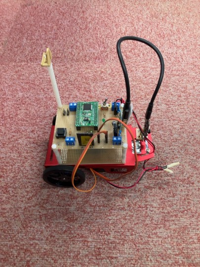
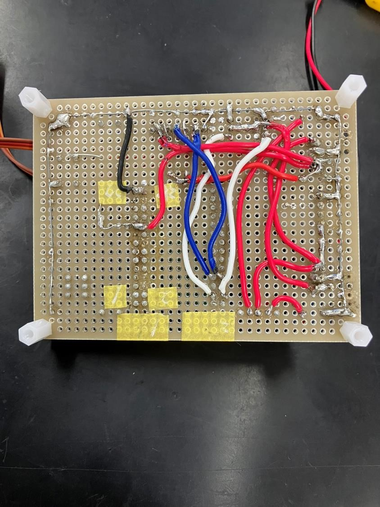
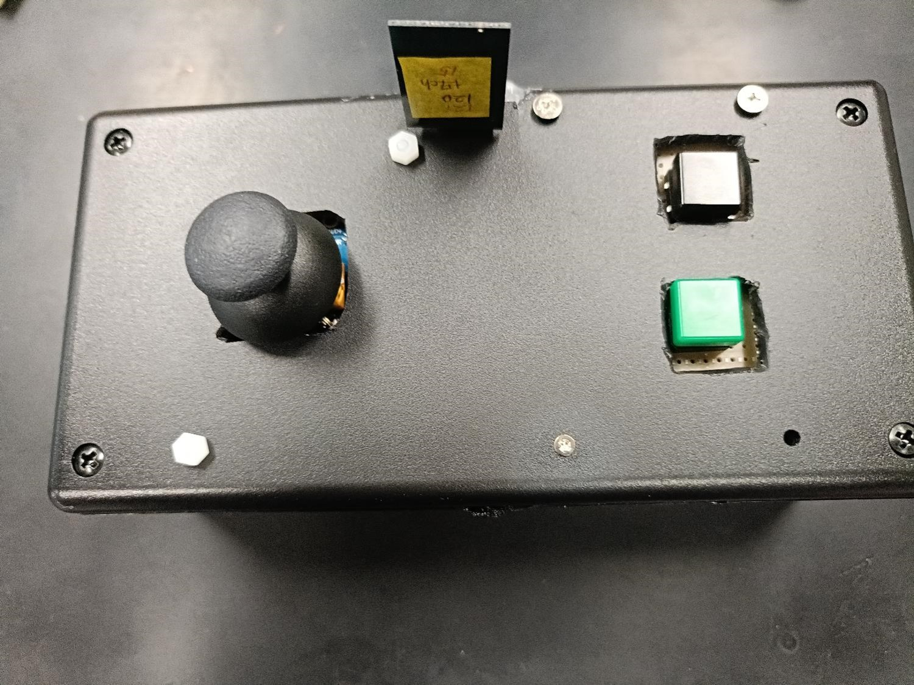

# 組込みマイコンロボット制作

## 概要

6か月間の組込み技術訓練の総復習として、チームで遠隔操縦可能なマイコンロボットを制作しました。

RX220マイコンを搭載したコントローラと車体を無線シリアル通信で接続し、ジョイスティックやスイッチによる遠隔操作を実現しました。

コントローラから送信された信号を車体側で受信し、モーターを制御することで前進・後退・左右旋回・停止を行います。

## 制作目的

マイコン制御、通信処理、モーター制御など、訓練で学習した組込み技術を組み合わせ、実際に動作するロボットを制作することを目的としました。

---

## 開発体制

本制作はチームで行い、ハードウェア製作とソフトウェア開発を分担して進めました。

### 担当内容

- コントローラ側プログラム開発
- 車体側プログラム開発
- 無線シリアル通信処理の実装
- モーター制御処理の実装
- 動作確認およびデバッグ

### ハードウェア

- 回路設計は担当メンバーが実施
- 基板製作やはんだ付け作業の一部に参加
- プログラムと回路を組み合わせた動作確認を実施

---

## 使用部品・開発環境

|項目|内容|
|---|---|
|マイコン|ルネサス エレクトロニクス RX220（R5F52206BDFM）|
|無線通信モジュール|モノワイヤレス TWE-Lite-UART|
|モーター|FEETECH FS90R|
|開発環境|CS+|
|プログラム言語|C言語|

## ハードウェア構成

車体全体の外観です。

### 基板写真

### コントローラ

本制作では、マイコン制御に必要な回路製作や基板作成もチームで行いました。

回路設計は担当メンバーが実施し、自分はプログラム開発を担当しました。
また、基板製作やはんだ付け作業の一部に参加し、プログラムと回路を組み合わせた動作確認を行いました。

### 回路図

（後日追加予定）

## システム構成

本ロボットは、操作用コントローラとマイコン制御車で構成されています。

## プログラム構成

### コントローラ側

#### 役割
ジョイスティックやスイッチの操作を読み取り、車体へ動作指令を送信する。

#### 処理内容
- ジョイスティックとスイッチの状態を読み取る
- 操作内容を0～4の信号に変換する
- 無線シリアル通信を使用して車体へ信号を送信する
- 100ms周期で操作状態を更新する

### 車体側

#### 役割
コントローラから受信した信号を判定し、モーターを制御する。

#### 処理内容
- 無線シリアル通信で信号を受信する
- 受信した0～4の信号を判定する
- PWM制御により左右のモーターを制御する
- 信号に応じて前進・後退・左右旋回・停止を行う

### 送信信号

|信号|動作|
|---|---|
|0|停止|
|1|前進|
|2|左旋回|
|3|右旋回|
|4|後退|

コントローラ側でジョイスティックやスイッチの操作を読み取り、0～4の信号に変換して車体へ送信します。

車体側では受信した信号を判定し、左右のモーターを制御することで、前進・後退・左右旋回・停止を行います。

## ソースコード構成

### controller

操作用コントローラのプログラムです。

- main.c  
  ジョイスティック・スイッチの入力処理、0～4の信号送信処理を実装

- hwsetup.c  
  マイコンの初期設定を実装

- intprg.c  
  割り込み処理の設定を実装

### robot

マイコン制御車のプログラムです。

- main.c  
  受信した0～4の信号を判定し、モーター制御を実装

- hwsetup.c  
  マイコンの初期設定を実装

- intprg.c  
  SCI5受信割り込み処理を実装

## Demo動画

## 開発プロセス

機能ごとにプログラムを作成し、動作確認を行った後に段階的に統合しました。

1. モーター制御テストプログラム作成
2. ジョイスティック制御テストプログラム作成
3. スイッチによるモーター制御プログラム作成
4. 無線通信テストプログラム作成
5. モーター制御とスイッチ制御の統合
6. 車体側プログラムの構築
7. コントローラ側プログラムの構築
8. モーター逆回転機能の追加
9. 後退動作の追加
10. 後退用信号の追加
11. 100ms周期での通信処理を実装

各機能を単体で確認した後に統合することで、問題発生時に原因を特定しやすい開発を行いました。

## 工夫した点

### 段階的なプログラム開発
機能ごとにプログラムを分けて作成し、動作確認を行った後に統合しました。

問題が発生した際に原因を特定しやすくするため、モーター制御・ジョイスティック制御・通信処理を個別に確認しました。

### シンプルな通信方式
コントローラから車体へ0～4の信号を送信し、受信側で信号に対応した動作を行う方式にしました。

少ないデータ量で操作指令を送信できるため、通信処理を簡単にすることができました。

### 100ms周期での通信処理
操作性とマイコンの処理負荷を考慮し、100ms周期で信号を送信する制御を実装しました。

人が操作するロボットでは十分な応答速度を確保しながら、不要な通信を減らすことを目的としました。

### モーター制御
左右のモーターを個別に制御することで、前進・後退だけでなく左右旋回を実現しました。

## 苦労した点・解決方法

プログラムを統合した際に、無線通信が正常に動作しなくなる問題が発生しました。

無線通信単体のテストプログラムでは正常に動作していたため、LEDを使用した状態確認や各処理の動作確認を行い、原因箇所の調査を行いました。

調査の結果、正常動作していた無線通信テスト用プログラムをベースに再構築することで、通信機能を復旧することができました。

問題を小さな機能単位に分けて確認することで、原因を特定し改善する経験を得ることができました。

## 今後の改善

- モーター速度制御機能の追加
- 操作性向上のための制御方法の改善
